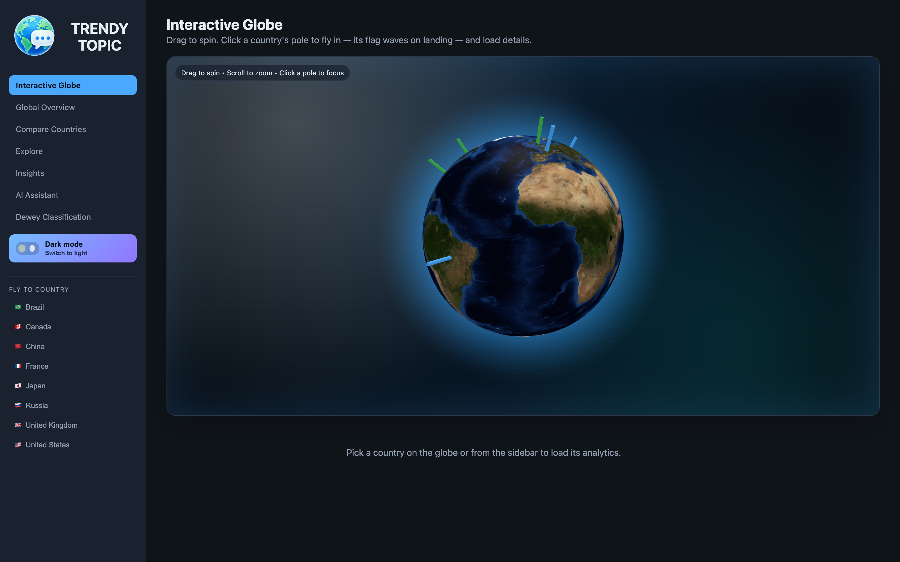
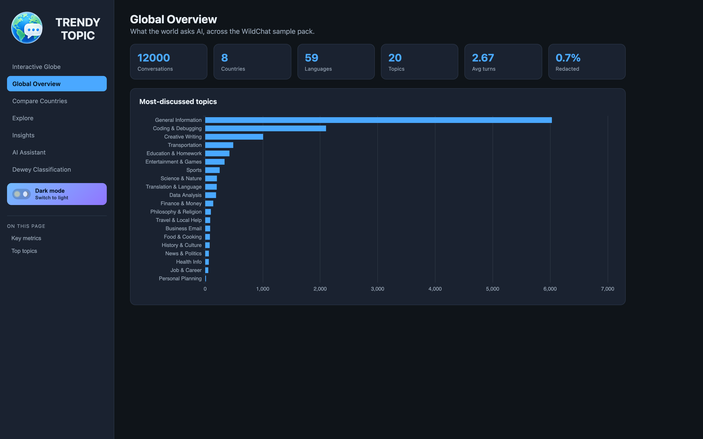
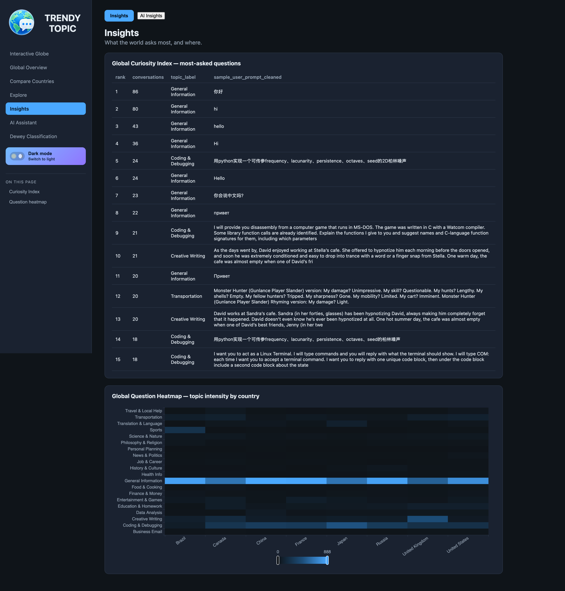
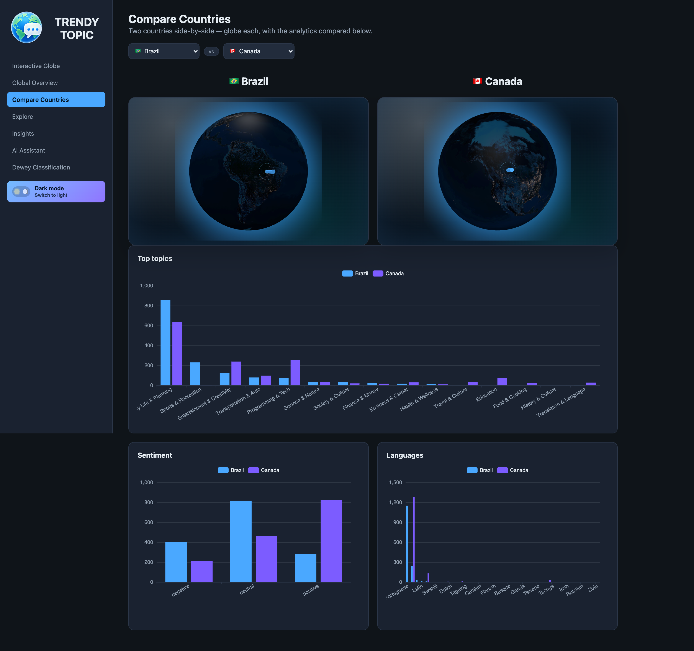
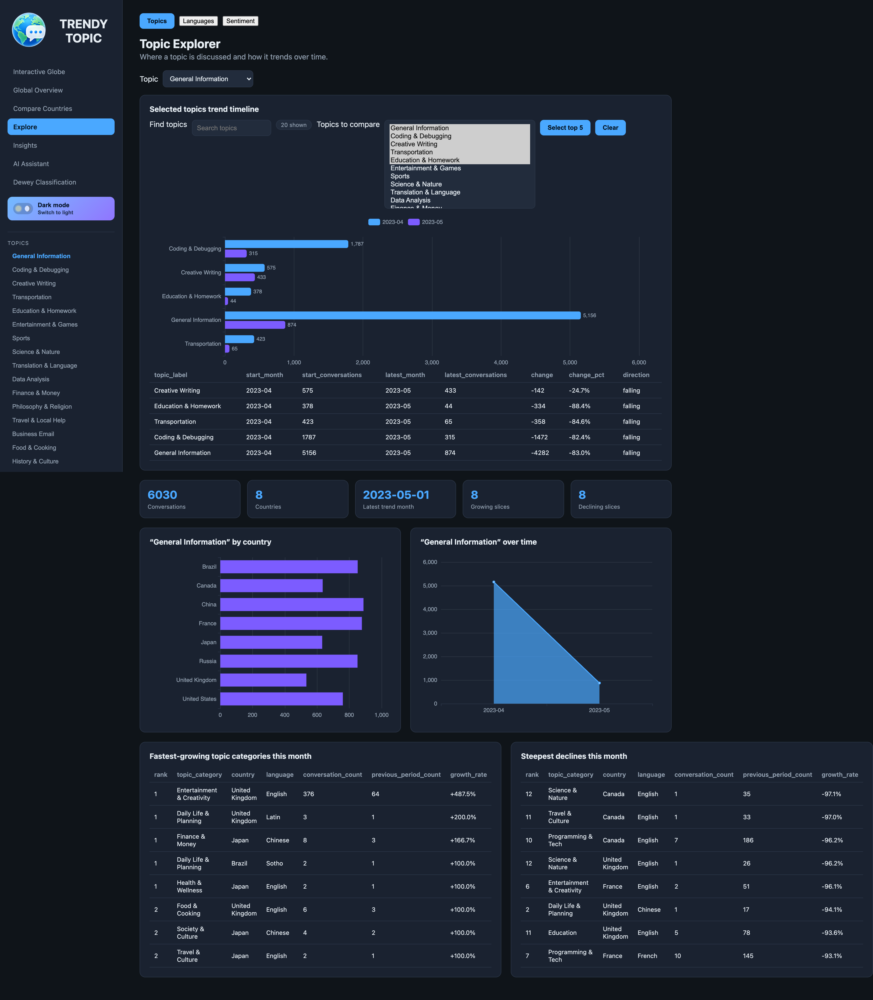
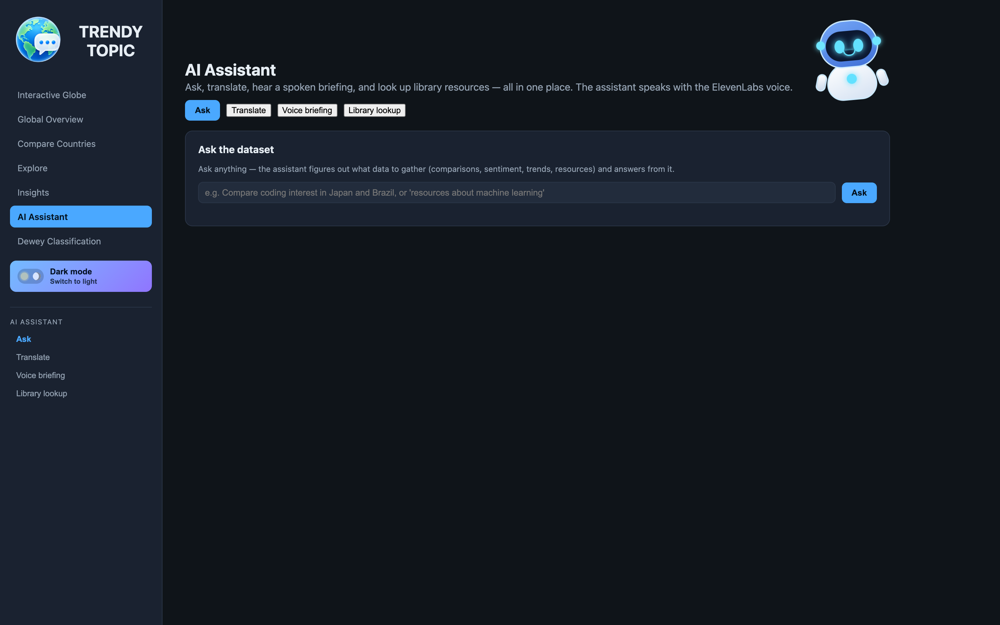
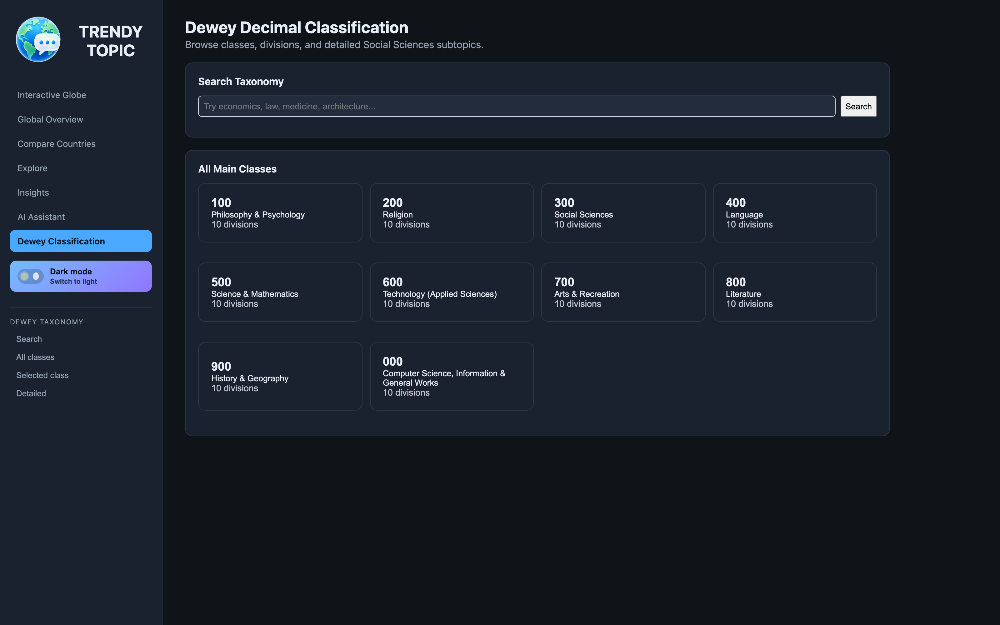

<h1 align="center">🌍 Trendy Topic</h1>
<p align="center"><b>What the World Asks AI</b><br/>
An interactive analytics platform that turns millions of global AI conversations into country, language, topic, sentiment, and trend insights.</p>

<p align="center">
  
  
  
  
  
  
  
  
  
  
  
  
</p>

<p align="center">
  
</p>

---

## Overview

**Trendy Topic** is a Google-Trends-style platform for AI conversations. It ingests WildChat-style global chat data, cleans and redacts it, enriches each record with topic / sentiment / language / country metadata, stores the results, and serves them through a fast React dashboard with a 3D globe, comparison charts, an AI assistant, translation, and spoken voice briefings.

It is built as a real, end-to-end product: a **FastAPI** backend (36 endpoints over a Pandas analytics layer + optional PostgreSQL) and a **React + TypeScript + Vite** frontend (Apache ECharts visualizations and a WebGL globe).

### Research questions it answers

- What are people asking AI most frequently across the world?
- How do interests differ by **country** and by **language**?
- Which topics generate the strongest positive, neutral, or negative **sentiment**?
- What questions are **trending**, and how do trends shift over time?
- Where is interest in programming, business, education, finance, health, or travel strongest?

---

## Table of Contents

- [Features](#features)
- [Screenshots](#screenshots)
- [Tech Stack](#tech-stack)
- [Architecture](#architecture)
- [Getting Started](#getting-started)
- [Usage](#usage)
- [Testing](#testing)
- [Project Structure](#project-structure)
- [Data &amp; Ethics](#data--ethics)

---

## Features

| | Feature | What it does |
|---|---|---|
| 🌐 | **Interactive Globe** | Spin a WebGL globe, click a country (or pick from the sidebar) to load its analytics. |
| 📊 | **Global Overview** | Headline KPIs — conversations, countries, languages — plus most-discussed topics and sentiment mix. |
| 🔍 | **Explore** | Filterable topic explorer across topics, languages, and sentiment. |
| 💡 | **Insights** | Global Curiosity Index (most-asked questions) and a topic-by-country question heatmap. |
| ⚖️ | **Compare Countries** | Side-by-side grouped bar charts comparing topics and behavior across countries. |
| 🤖 | **AI Assistant** | One place to **Ask** the dataset, **Translate** a summary, hear a **Voice briefing**, and do a **Library lookup** — powered by Groq (with an automatic Claude fallback) and ElevenLabs voice. |
| 📚 | **Dewey Classification** | Maps each prompt into a Dewey Decimal class, browsing what the world asks by knowledge domain. |

**Resilience built in:** translation degrades gracefully from the cloud LLM to a free Google endpoint to a fully offline engine, and voice briefings fall back to a pre-recorded MP3 when no ElevenLabs key is present — so the demo always works, with or without API keys.

---

## Screenshots

<table>
  <tr>
    <td width="50%"><b>Global Overview</b><br/></td>
    <td width="50%"><b>Insights — Curiosity Index &amp; Heatmap</b><br/></td>
  </tr>
  <tr>
    <td width="50%"><b>Compare Countries</b><br/></td>
    <td width="50%"><b>Explore Topics</b><br/></td>
  </tr>
  <tr>
    <td width="50%"><b>AI Assistant</b><br/></td>
    <td width="50%"><b>Dewey Classification</b><br/></td>
  </tr>
</table>

> Screenshots are dark mode; the app ships with a light/dark toggle (a matching light set lives in [`assets/screenshots/`](assets/screenshots/)).

---

## Tech Stack

**Backend**
- **FastAPI** + **Uvicorn** — 36-endpoint REST API
- **Pandas** + **pyarrow** — analytics over the WildChat country CSV pack
- **PostgreSQL** via **SQLAlchemy** + **psycopg** — optional persistent storage (translations, voice briefs, Dewey index)
- **vaderSentiment** / **langdetect** — sentiment + language detection
- **deep-translator → Argos Translate → Google Cloud Translate** — layered translation
- **Groq** (primary) with **Anthropic Claude** fallback — LLM for Ask, topic extraction, and synthesis
- **ElevenLabs** — text-to-speech voice briefings
- **scikit-learn** — country clustering / similarity

**Frontend**
- **React 18** + **TypeScript 5** + **Vite 5**
- **Apache ECharts** (`echarts-for-react`) — charts and heatmaps
- **react-globe.gl** + **three.js** — the WebGL globe
- **react-router-dom** — routing

**Tooling:** Docker + docker-compose, pytest (238 tests), VS Code one-click launch.

---

## Architecture

```text
                         ┌────────────────────────────┐
   Browser  ─────────►   │  React + Vite (port 5173)   │
                         │  ECharts · WebGL globe      │
                         └──────────────┬─────────────┘
                              /api proxy │
                         ┌──────────────▼─────────────┐
                         │  FastAPI (port 8000)        │
                         │  36 endpoints               │
                         └──────────────┬─────────────┘
              ┌──────────────┬──────────┴───────┬────────────────┐
              ▼              ▼                  ▼                ▼
        Pandas analytics  PostgreSQL      LLM (Groq/Claude)  ElevenLabs +
        over WildChat     (optional)      + translation      MP3 fallback
        CSV pack                           layer
```

The data pipeline: **ingest** (CSV/JSON/Parquet) → **clean & PII-redact** → **enrich** (topic, sentiment, language, country, time) → **translate** non-English summaries → **store** → **serve** to the dashboard.

---

## Getting Started

### Prerequisites
- Python 3.14 and Node 18+
- (Optional) PostgreSQL, and API keys for Groq / Anthropic / ElevenLabs — the app runs without them thanks to built-in fallbacks.

### Run everything (one command)
```bash
./start.sh
```
This frees ports 8000/5173, starts the API + frontend, and opens the dashboard. In VS Code you can instead hit **Run and Debug → “Start Trendy Topic Stack.”**

- Backend (FastAPI): http://localhost:8000
- Frontend (Vite): **http://localhost:5173** ← open this

### Run pieces manually
```bash
.venv/bin/uvicorn api.main:app --reload --port 8000   # backend only
cd frontend && npm run dev                             # frontend only
```

---

## Usage

A suggested walk-through:

1. **Globe** — spin and click a country to load its analytics.
2. **Overview** — read the headline counts and topic/sentiment mix.
3. **Compare** — put two or more countries side by side.
4. **Insights** — explore the Global Curiosity Index and question heatmap.
5. **AI Assistant** — ask *“What topics are growing fastest in Brazil?”*, translate a summary, then generate a spoken country briefing.
6. **Dewey Classification** — browse what the world asks by knowledge domain.

### Index full WildChat into Dewey classes
```bash
python -m src.dewey_prompt_index --dataset allenai/WildChat --split train \
  --limit 1000000 --out-csv data/exports/wildchat_dewey_index.csv --replace-output
# add --to-db --replace-db to write rows into PostgreSQL (needs DATABASE_URL)
```

---

## Testing

```bash
.venv/bin/python -m pytest -q     # 238 tests
cd frontend && npm run build      # frontend typecheck + production build
```

Tests isolate every external dependency (LLM, translation, voice, DB) so the suite runs fully offline and never bills an API.

---

## Project Structure

```text
Trendy Topic/
├── api/                  # FastAPI app (main.py — 36 endpoints)
├── src/                  # Python analytics + AI layer
│   ├── ingest.py · clean.py · analysis.py        # ETL + metrics
│   ├── topic_classifier.py · sentiment.py        # enrichment
│   ├── language_detector.py · translator.py      # language + translation
│   ├── llm.py · ai_assistant.py · ask.py         # LLM (Groq/Claude) + Ask
│   ├── ai_extraction.py · ai_topic_extraction.py # LLM topic extraction
│   ├── voice_briefing.py                         # ElevenLabs briefings
│   ├── dewey_taxonomy.py · dewey_prompt_index.py # Dewey classification
│   └── db.py · data_access.py · geo.py           # storage + access
├── frontend/             # React + TypeScript + Vite
│   └── src/pages/        # Globe, Overview, Compare, Explore, Insights,
│                         # AIAssistant, DeweyTaxonomy
├── sql/                  # schema, indexes, country seed
├── data/                 # WildChat country CSV pack (raw files gitignored)
├── assets/               # icon, audio briefings, screenshots
├── docs/                 # data dictionary, ethics policy, findings, demo script
├── tests/                # 238 pytest tests
├── Dockerfile · docker-compose.yml
└── start.sh
```

---

## Data &amp; Ethics

Trendy Topic is built around **WildChat**, a public corpus of real ChatGPT conversations. Privacy is enforced by design:

- Raw conversation text is **never** sent to translation, voice, or LLM features — only aggregated metrics and PII-redacted summaries.
- Toxic and unsafe records are excluded; large raw datasets are gitignored.
- Data limitations are surfaced in the dashboard rather than hidden.

The sample shipped here is starter-scale, not the full 3.2M-conversation corpus. See [`docs/ethics_policy.md`](docs/ethics_policy.md) and [`docs/findings.md`](docs/findings.md) for details.

---

<p align="center"><sub>Capstone project · Data Engineering + NLP + LLM Analytics + Interactive Dashboard</sub></p>
